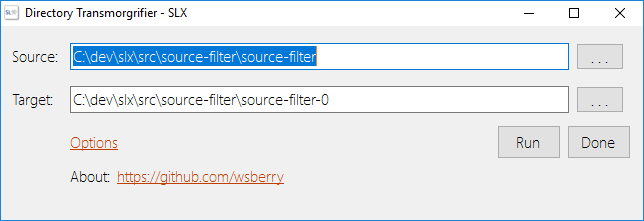

### Source-Filter Project Overview

#### Introduction

Source-Filter is an example of a Model-View-Controller (MVC) application 
using WinForms and C#. It was written as a testing tool
for experimenting with copying files more efficiently with the .NET
libraries (using buffered copying vs using the System.IO.File.Copy). 
This program let's you experiment with the following options:

1. A buffered file copy written in C#.
2. A buffered file copy written in C++. 
3. Using 'System.IO.File.Copy' in .NET.
4. Using 'std\::filesystem\::copy'.

The .NET StopWatch is used to evaluate the elapsed time to complete a given transaction.

Why 'WinForms'? For me I can accomplish the layout of a UI much more
quickly as compared to using WPF/XAML. 

#### Overview
The behaviors of the application's view are handled by the controller. For example,
the main form in this application is implemented as follows:

~~~c-sharp
public partial class MainForm : Form
{
    // Note:
    // A more generic controller could be constructed
    // and then injected via a generalized controller
    // interface.
    // 
    private ApplicationController controller_;

    public MainForm()
    {
        InitializeComponent();
    }

    private void MainForm_Load(object sender, EventArgs e)
    {
        // View behaviors are defined in the controller.
        // This is why the Form instance, MainForm, is passed  
        // into the controller. The controller then enumerates
        // the controls of the MainForm widgets (e.g. Buttons,
        // Panels, TextBoxs) and binds each control to various
        // notification handlers.
        //
        controller_ = new ApplicationController(this);
    }

    // The only control behavior implemented in the MainForm 
    // is related to the 'OnClosing' event handler.
    //
    protected override void OnClosing(CancelEventArgs e)
    {
        controller_.SaveModel();
        base.OnClosing(e);
    }
}
~~~
##### Note 
It would be possible, via an adapter, to map WPF UI 
view objects to the already defined behaviors in 
the controller. Furthermore, this could be accomplished
without needing to change the controller's source code 
(other than combining the adapter code with the controller).

#### What this Application Does

This application will let you make a 'filtered' copy of a top level directory
and all its children (or just the top level directory). It is possible to 
filter by directory, file, or file extension names.

##### Views

##### Filtering Rules File Example

~~~json
{
  "DirectoryInfo": {
    "OpenTargetDirectoryWhenDone": true,
    "IncludeSubDirectories": true,
    "SourceDirectory": "C:\\dev\\slx\\src\\source-filter\\source-filter",
    "TargetDirectory": "C:\\dev\\slx\\src\\source-filter\\source-filter-0",
    "FileExtensionNameFilters": [
      ".DotSettings.user"
    ],
    "FileNameFilters": [],
    "DirectoryNameFilters": [
      ".vs",
      "_build",
      "obj",
      "bin",
      "Debug",
      "Release",
      "x64",
      "*.usr",
      "*.db"
    ]
  },
  "MainFormTitle": "Directory Filter - SLX",
  "ModelEditor": "Notepad++",
  "ModelName": ".SourceFilter"
}
~~~

#### Special Notes
* Empty directories are ignored and therefore not 
copied. 

* This application uses the Vitevic Assembly Embedder which allows the merging of the Newtonsoft.Json assembly into the main application as an embedded resource. 
Using this tool means that the 'source-filer.exe' may be distributed without installing any external DLL dependencies.

* The tool is available here: [Vitevic Assembly Embedder](https://marketplace.visualstudio.com/items?itemName=Vitevic.VitevicAssemblyEmbedder)
* The Mark Down Editor I used is [here](https://marketplace.visualstudio.com/items?itemName=MadsKristensen.MarkdownEditor).

* When creating WinForm applications I higly recommend using the
following attributes in your form attributes. These will ensure
that your views are displayed correctly and uniformly across 
disparate monitor scalings.
~~~c-sharp
this.AutoScaleDimensions = new System.Drawing.SizeF(96F, 96F);
this.AutoScaleMode = System.Windows.Forms.AutoScaleMode.Dpi;
~~~
<i>Be aware that these attributes will be changed by the Visual Studio 
designer if the main monitor is not set to a scale of 100%.</i>

Please address questions to <wberry.cpp@gmail.com> 